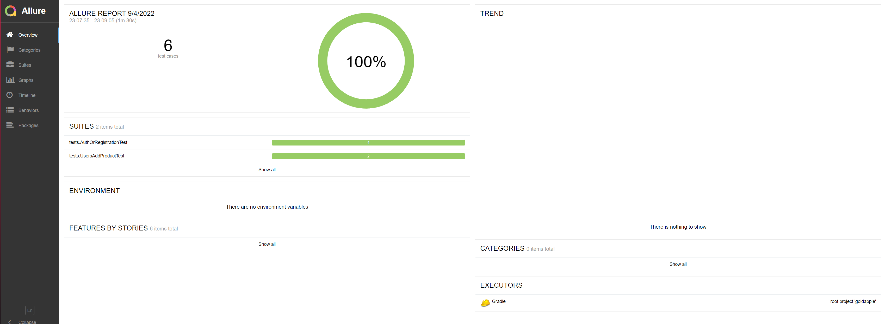
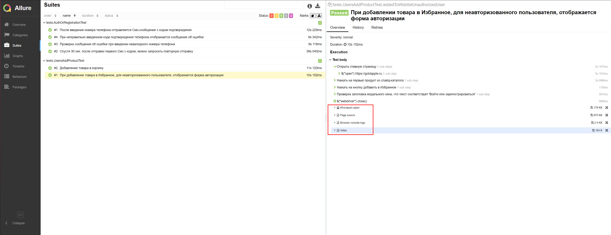
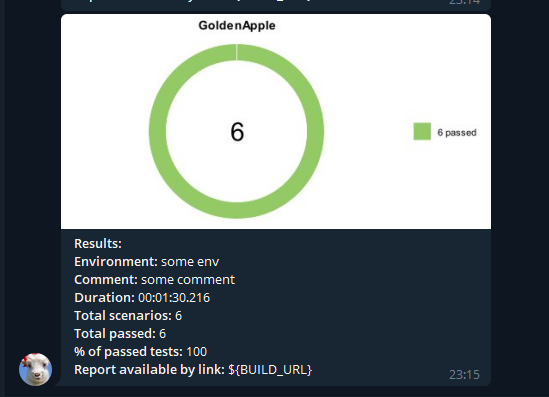

# Проект по автоматизации тестирования веб-приложения "Золотое яблоко"
## <a target="_blank" href="https://goldapple.ru/">Золотое яблоко - интернет магазин косметики и парфюмерии</a>
<p align="center">

</p>


## :floppy_disk: Содержание:

- <a href="#computer-технологии-и-инструменты">Технологии и инструменты</a>
- <a href="#notebook_with_decorative_cover-реализованные-проверки">Реализованные проверки</a>
- <a href="#arrow_forward-запуск-из-терминала">Запуск из терминала</a>
- <a href="#open_book-allure-отчет">Allure отчет</a>
- <a href="#robot-отчет-в-telegram">Отчет в Telegram</a>

***

## :computer: Технологии и инструменты
<p align="center">


</p>

***

## :notebook_with_decorative_cover: Реализованные проверки
- После ввода номера телефона отправляется Смс-сообщение с кодом подтверждения
- При неправильно введенном коде подтверждения отображается сообщение об ошибке
- При вводе невалидного номера телефона отображается сообщение об ошибке
- Через 30 секунд после отправки первого Смс с котом подтверждения можно запросить повторную отправку кода
- При добавлении товара в корзину - отображается количество добавленных товаров в шапке страницы 
- При добавлении товара в Избранное, для неавторизованного пользователя, отображается форма авторизации

***


## :arrow_forward: Запуск из терминала
Локальный запуск:
```
gradle clean test -Dhost=local 
```


Удаленный запуск из Jenkins:
```
clean
test
-Dhost=remote
-DbrowserName=${BROWSERNAME}
-DbrowserVersion=${VERSION}
-DbrowserSize=${BROWSERSIZE}
```
***

## :open_book: Allure отчет
- ### Главный экран отчета
<p align="center">

</p>

- ### Страница с проведенными тестами
*Можно подробно разобрать каждый шаг тест кейса, сбоку отображаются все шаги и тестовые данные. И к каждому тесту прикреплены аттачи*
<p align="center">

</p>

***

## :robot: Отчет в Telegram
<p align="center">

</p>

